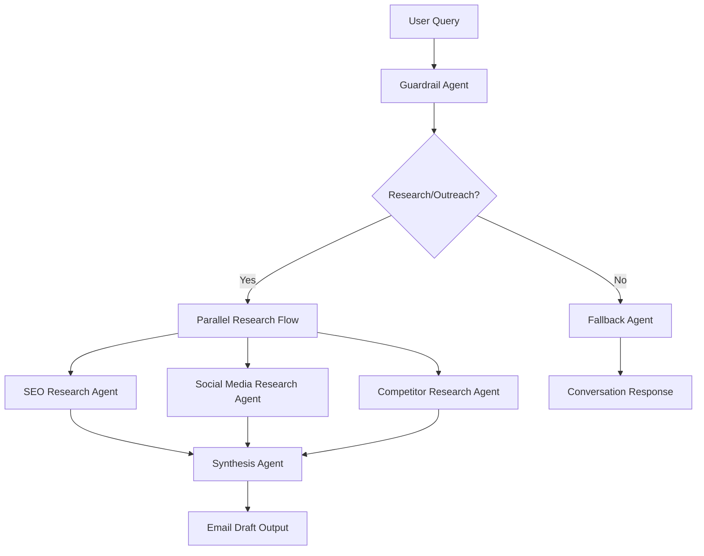

# Parallel Research & Synthesis Agent System

A specialized multi-agent system using Pydantic AI and LangGraph for automated comprehensive research. This system executes 3 parallel research agents (SEO, Social Media, Competitor) simultaneously, then synthesizes findings into actionable intelligence reports, optimizing for speed and comprehensive analysis.

## Features

- **Guardrail Routing**: Lightweight agent determines if requests are for research/outreach or normal conversation
- **Parallel Execution**: 3 specialized research agents run simultaneously for ~50% faster research
- **Specialized Research**: SEO analysis, social media insights, and competitive intelligence in parallel
- **Research Synthesis**: Advanced synthesis agent combines all findings into comprehensive intelligence reports
- **Streaming Support**: Real-time response streaming from all parallel agents simultaneously
- **Cost Optimization**: Small model for guardrail decisions, larger models for research and synthesis
- **Conversation Management**: Only synthesis and fallback agents update conversation history

## Architecture



### Parallel Research Flow:
1. **Guardrail Agent**: Detects research/outreach requests vs normal conversation (lightweight, fast)
2. **Parallel Research Agents** (run simultaneously):
   - **SEO Research Agent**: Search rankings, domain authority, digital presence analysis
   - **Social Media Research Agent**: LinkedIn, Twitter, engagement metrics, thought leadership
   - **Competitor Research Agent**: Market positioning, funding data, competitive intelligence
3. **Synthesis Agent**: Combines all research streams into comprehensive research synthesis with actionable insights
4. **Fallback Agent**: Handles normal conversational requests

### Conversation History Strategy:
- **Parallel Research Agents**: Stream responses to user but don't update conversation history
- **Final Agents**: Only synthesis and fallback agents update conversation history
- **State Merging**: LangGraph uses operator.add to merge parallel agent outputs efficiently

### Performance Optimization Strategy:
- **Parallel Execution**: ~50% faster research through simultaneous agent execution
- **Minimal Guardrail Dependencies**: Guardrail agent uses only session ID for fast routing decisions
- **Specialized Agents**: Each research agent focuses on specific domain expertise
- **Streaming with Fallback**: Real-time feedback from all parallel agents reduces perceived latency
- **Efficient State Merging**: LangGraph manages concurrent state updates using operator.add

## Installation

1. **Navigate to this directory**:

```bash
cd 7_Agent_Architecture/7.6-ParallelAgents
```

2. **Create and activate virtual environment**:
```bash
# Linux/Mac
python -m venv venv_linux
source venv_linux/bin/activate

# Windows
python -m venv venv_windows
venv_windows\Scripts\activate
```

3. **Install dependencies**:
```bash
pip install -r requirements.txt
```

4. **Set up environment variables**:
```bash
cp .env.example .env
# Edit .env with your configuration
```

## Environment Variables

Create a `.env` file with the following variables:

```env
# ===== LLM Configuration =====
LLM_PROVIDER=openai
LLM_API_KEY=sk-your-openai-api-key-here
LLM_CHOICE=gpt-4o-mini
LLM_CHOICE_SMALL=gpt-4o-nano  # For guardrail agent
LLM_BASE_URL=https://api.openai.com/v1

# ===== Supabase Configuration =====
SUPABASE_URL=your_supabase_url
SUPABASE_SERVICE_KEY=your_supabase_service_key

# ===== Brave Search Configuration =====
BRAVE_API_KEY=BSA-your-brave-search-api-key-here

# ===== Langfuse Configuration (Optional) =====
LANGFUSE_PUBLIC_KEY=pk-lf-your-public-key
LANGFUSE_SECRET_KEY=sk-lf-your-secret-key
LANGFUSE_HOST=https://us.cloud.langfuse.com

# ===== Application Configuration =====
APP_ENV=development
LOG_LEVEL=INFO
DEBUG=false
PORT=8040
```

**Required Services:**
- **OpenAI API**: For LLM models and embeddings
- **Supabase**: For document storage and conversation history
- **Brave Search API**: For web search functionality
- **Gmail API**: For email draft creation (compose/send scope)

**Optional Services:**
- **LangFuse**: For complete agent observability and tracing

## Usage

### 🚀 **Full API Server** (Recommended)

The recommended way to use the system for production:

```bash
# Start the full API server
python -m uvicorn api.endpoints:app --host 0.0.0.0 --port 8040 --reload
```

**Features:**
- **JWT Authentication** via Supabase
- **Conversation history** 
- **User management**
- **Rate limiting**
- **Parallel workflow metadata**

**API Endpoints:**
- `POST /api/langgraph-parallel-agents` - Main parallel research workflow endpoint (requires auth)
- `GET /health` - Health check
- `GET /` - System information

**Example API call:**
```bash
curl -X POST http://localhost:8040/api/langgraph-parallel-agents \
  -H "Content-Type: application/json" \
  -H "Authorization: Bearer your-jwt-token" \
  -d '{
    "query": "Research Jane Doe at InnovateCorp and draft an outreach email",
    "user_id": "user123",
    "request_id": "req456", 
    "session_id": "session789"
  }'
```

### 🖥️ **Frontend Interface** (AI Agent Mastery Course Web Interface)

To interact with this API endpoint through the web interface:

1. **Open a new terminal** (keep the API server running in the first terminal)

2. **Navigate to the frontend directory**:
```bash
cd ../6_Agent_Deployment/frontend
```

3. **Update the agent endpoint in your `.env` file**:
```bash
# Update the VITE_AGENT_ENDPOINT variable to:
VITE_AGENT_ENDPOINT=http://localhost:8040/api/langgraph-parallel-agents
```

4. **Start the frontend**:
```bash
npm run dev
```

5. **Access the interface** at `http://localhost:8080` (or check the terminal for the exact port)

### 🎯 **Streamlit Web Interface** (Quick Testing)

A simple way to quickly test the agent with a basic UI:

```bash
# Make sure you're in the project directory and virtual environment is activated
streamlit run streamlit_app.py
```

- **No authentication required**
- **Real-time streaming responses**
- **Parallel workflow indicators**
- **Clean, simple interface**
- **Session management**

### Example Queries:

**Research Requests:**
```
"Research John Doe at TechCorp"
"I want to start an AI pet startup for dogs"
"Analyze the market for sustainable fashion"
"What's the competitive landscape for meal delivery services?"
"Research blockchain applications in healthcare"
"I'm thinking about launching a SaaS product"
```

**Normal Conversation:**
```
"How are you today?"
"What's the weather like?"
"Explain machine learning to me"
"Help me understand this concept"
```


## Parallel Workflow Logic

The guardrail agent analyzes queries and routes to:

### Research Flow (`research_request`)
Triggers the complete parallel research workflow for requests involving:
- Researching people, companies, or business ideas
- Market analysis and competitive intelligence
- Industry trends and opportunities
- Startup concepts and business viability
- **Examples**: 
  - "Research John Doe at TechCorp"
  - "I want to start an AI pet startup"
  - "Analyze the EdTech market"

**Parallel Execution Steps:**
1. **3 Research Agents Run Simultaneously**:
   - **SEO Research Agent**: Digital presence, search rankings, website analysis
   - **Social Media Research Agent**: LinkedIn profiles, engagement metrics, thought leadership
   - **Competitor Research Agent**: Market position, funding data, competitive intelligence
2. **Synthesis Agent**: Combines all research streams into comprehensive research synthesis

### Normal Conversation (`conversation`)
Routes directly to fallback agent for:
- General assistant queries
- Casual conversation
- System help and guidance
- **Example**: "How are you today?"

## Response Format

All interfaces return responses with parallel workflow metadata:

```json
{
  "text": "I've completed comprehensive parallel research on John Doe and synthesized an email draft...",
  "session_id": "session789",
  "is_research_request": true,
  "routing_reason": "This is a research and outreach request",
  "seo_research": "John Doe's company TechCorp has strong domain authority and organic presence...",
  "social_research": "John Doe has 10k+ LinkedIn connections and is active in AI discussions...",
  "competitor_research": "TechCorp recently raised $50M Series B and is positioned well against competitors...",
  "research_synthesis": "Comprehensive analysis synthesizing all research findings...",
  "synthesis_complete": true,
  "complete": true
}
```

## System Components

### Agents (`agents/`)
- **Guardrail Agent**: Lightweight routing decisions with minimal dependencies
- **SEO Research Agent**: Search engine optimization and digital presence analysis
- **Social Media Research Agent**: Social platforms analysis and engagement metrics
- **Competitor Research Agent**: Market positioning and competitive intelligence
- **Synthesis Agent**: Combines all research streams into coherent email drafts
- **Fallback Agent**: Normal conversation handling
- **Dependencies**: Shared dependency injection patterns

### Tools (`tools/`)
- **Brave Tools**: Brave API search with error handling and relevance scoring (used by all research agents)

### Workflow (`graph/`)
- **State Management**: Parallel agent state with operator.add for concurrent updates
- **Workflow Orchestration**: LangGraph-based parallel execution with fan-out/fan-in pattern

### API (`api/`)
- **Models**: Pydantic models for requests/responses
- **Endpoints**: FastAPI endpoints with authentication
- **Streaming**: Real-time response streaming utilities
- **Database Utils**: Supabase integration for conversationsd

## Observability & Monitoring

The system includes **LangFuse integration** for comprehensive observability:

### LangFuse Features
- **Sequential Workflow Tracing**: Full visibility into each agent in the workflow
- **Cost Analysis**: Track efficiency of guardrail routing and agent usage
- **Performance Metrics**: Response times and success rates per workflow step
- **User & Session Tracking**: Analyze workflow patterns by user
- **Optional Setup**: Works seamlessly when configured, gracefully disabled when not

### Setup LangFuse (Optional)
1. Sign up at [LangFuse Cloud](https://us.cloud.langfuse.com/)
2. Create a new project and get your keys
3. Add to your `.env` file:
   ```env
   LANGFUSE_PUBLIC_KEY=pk-lf-your-public-key
   LANGFUSE_SECRET_KEY=sk-lf-your-secret-key
   LANGFUSE_HOST=https://us.cloud.langfuse.com
   ```
4. Restart your application - tracing will automatically begin

## Development

### Running Tests

```bash
# Run all tests
source venv_linux/bin/activate  # or venv_windows\Scripts\activate
pytest tests/ -v

# Run specific agent tests
pytest tests/test_guardrail_agent.py -v
pytest tests/test_seo_research_agent.py -v
pytest tests/test_social_research_agent.py -v
pytest tests/test_competitor_research_agent.py -v
pytest tests/test_synthesis_agent.py -v
pytest tests/test_fallback_agent.py -v

# Run workflow tests
pytest tests/test_parallel_workflow.py -v

# Run with coverage
pytest tests/ --cov=agents --cov=tools --cov=graph --cov=api
```

### Project Structure

```
agents/
├── __init__.py
├── deps.py                    # Dependency injection patterns
├── prompts.py                # Centralized system prompts
├── guardrail_agent.py        # Research/conversation routing
├── seo_research_agent.py     # SEO and digital presence research
├── social_research_agent.py  # Social media and engagement research
├── competitor_research_agent.py # Market and competitive intelligence
├── synthesis_agent.py        # Research synthesis and email drafting
└── fallback_agent.py         # Normal conversation

tools/
├── __init__.py
└── brave_tools.py            # Brave API integration (used by all research agents)

graph/
├── __init__.py
├── state.py                  # Parallel agent state management with operator.add
└── workflow.py               # LangGraph parallel workflow with fan-out/fan-in

api/
├── __init__.py
├── endpoints.py              # FastAPI server with parallel workflow
├── models.py                 # Pydantic models
├── streaming.py              # Streaming utilities
└── db_utils.py               # Supabase integration

tests/
├── __init__.py
├── test_guardrail_agent.py   # Guardrail routing tests
├── test_seo_research_agent.py # SEO research agent tests
├── test_social_research_agent.py # Social media research agent tests
├── test_competitor_research_agent.py # Competitor research agent tests
├── test_synthesis_agent.py   # Synthesis agent tests
├── test_fallback_agent.py    # Fallback agent tests
├── test_tools.py             # Tool function tests
└── test_parallel_workflow.py # Parallel workflow integration tests

streamlit_app.py              # Streamlit interface
requirements.txt              # Dependencies
.env.example                  # Environment template
```

## Troubleshooting

### Common Issues

1. **Import Errors**: Ensure all dependencies are installed and virtual environment is activated
2. **Environment Variables**: Check `.env` file configuration
3. **Supabase Connection**: Verify Supabase credentials and connection
4. **Brave API**: Verify Brave Search API key is valid
5. **Gmail Setup**: Ensure OAuth2 credentials and compose/send scope configuration
6. **Port Conflicts**: Default port is 8040 for the API server

### Debug Mode

Enable debug output:
```bash
export DEBUG=true
export LOG_LEVEL=DEBUG
```

### Workflow Issues

Check guardrail routing decisions:
- **Research Requests**: Should include research + email creation intent
- **Normal Conversation**: General questions, explanations, casual chat
- **Parallel State Merging**: Verify research data merges correctly with operator.add
- **Synthesis Integration**: Check that synthesis agent receives all research streams

### Common Workflow Patterns

**Successful Parallel Research Flow:**
1. Guardrail detects research intent → `is_research_request: true`
2. Three agents execute simultaneously → `seo_research`, `social_research`, `competitor_research` populated
3. Synthesis agent combines all research → `email_draft` populated, `synthesis_complete: true`

**Conversation Flow:**
1. Guardrail detects conversation → `is_research_request: false`
2. Routes directly to fallback agent

### Rate Limiting & API Usage

**Brave Search API:**
- Built-in 1-second delay between API calls to prevent quota issues
- Parallel research flow makes 3 simultaneous API calls (SEO + Social + Competitor)
- Rate limiting helps avoid 429 errors during concurrent execution

## Performance & Cost Optimization Notes

- **Guardrail Efficiency**: Uses smaller model for fast routing decisions
- **Parallel Execution**: ~50% faster research through simultaneous agent execution
- **Specialized Focus**: Each agent optimizes for specific research domain
- **Streaming Strategy**: Real-time feedback from all agents reduces perceived latency
- **State Management**: Efficient concurrent updates using operator.add pattern

This architecture provides both speed and comprehensive research capabilities by executing specialized agents in parallel with intelligent state merging.

## Examples

### Research & Outreach Example

**Input:**
```
"Research Sarah Chen at DataFlow Inc and draft a partnership email"
```

**Parallel Workflow:**
1. **Guardrail**: Detects research + email intent
2. **Parallel Research Agents (simultaneous execution)**:
   - **SEO Agent**: DataFlow Inc domain analysis, search rankings, digital presence
   - **Social Agent**: Sarah's LinkedIn profile, engagement metrics, recent posts
   - **Competitor Agent**: DataFlow Inc funding, market position, competitive landscape
3. **Synthesis**: Combines all research streams into comprehensive email draft

**Output:**
```
✉️ I've completed comprehensive parallel research on Sarah Chen at DataFlow Inc and synthesized a professional outreach email.

🔍 SEO Research: DataFlow Inc has strong domain authority (78) with growing organic traffic. Sarah appears in multiple high-ranking technical blog posts...

📱 Social Research: Sarah Chen has 8k+ LinkedIn connections and regularly posts about data architecture. Recent posts show thought leadership in real-time analytics...

🏢 Competitor Research: DataFlow Inc raised $25M Series A in 2023, positioning well against competitors like Databricks. Strong growth in enterprise analytics market...

📝 Research Synthesis: A comprehensive analysis integrating insights from all research streams, providing strategic intelligence based on digital presence, social thought leadership, and market positioning analysis.
```

### Conversation Example

**Input:**
```
"How does machine learning work?"
```

**Workflow:**
1. **Guardrail**: Detects conversation intent
2. **Fallback**: Provides educational explanation

**Output:**
```
Machine learning is a subset of artificial intelligence that enables computers to learn and improve from experience without being explicitly programmed...
```

This parallel agent system optimizes for comprehensive, fast professional research through simultaneous specialized analysis while maintaining natural conversation capabilities.